# 👾 My Hyprland Dotfiles

[English Version](README.md)

---

Benvenuti nel mio repository di dotfiles! Questo setup è basato su **Hyprland** e punta a unire un'estetica accattivante (con un tocco retro-gaming) a un'alta produttività ed efficienza.

Ho dedicato molto tempo alla creazione di widget personalizzati per avere tutto a portata di mano senza dover aprire il terminale per le operazioni di base.

### 📸 Showcase

#### Desktop & Workflow
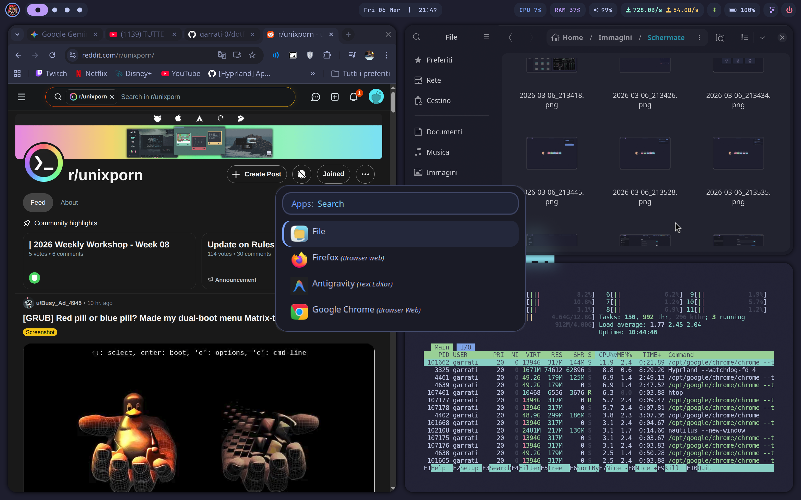
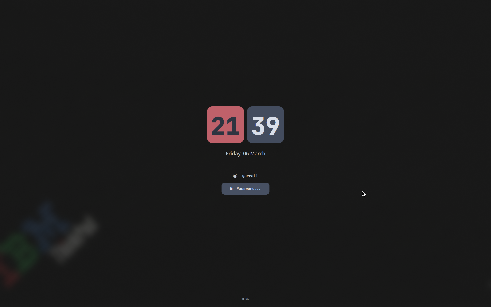
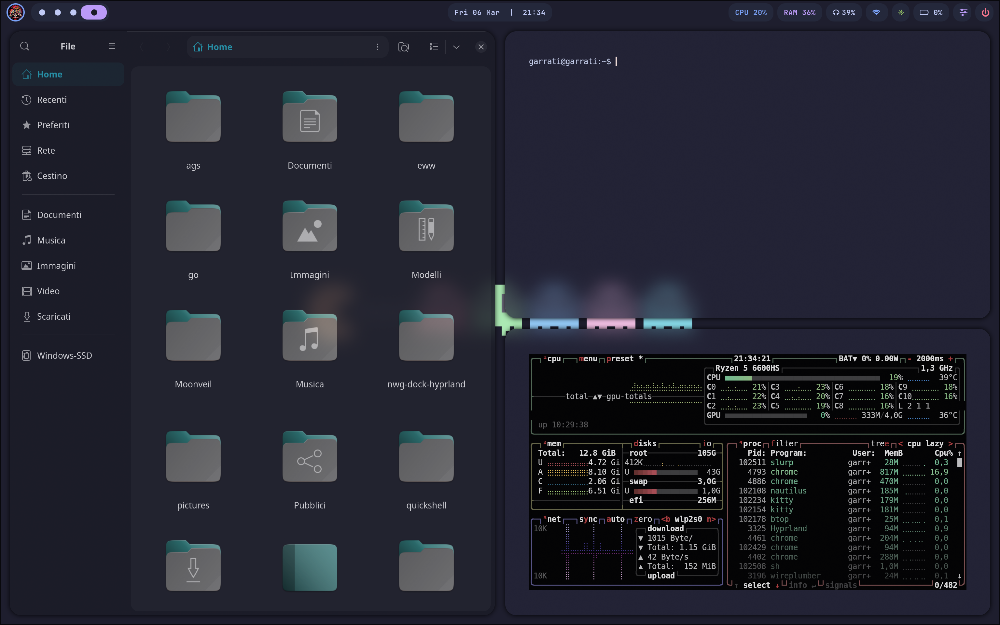

#### Control Center & Widget personalizzati
Il cuore del setup. Un control center completo e menu rapidi per gestire il sistema.
**Versione 1 (Classic):**
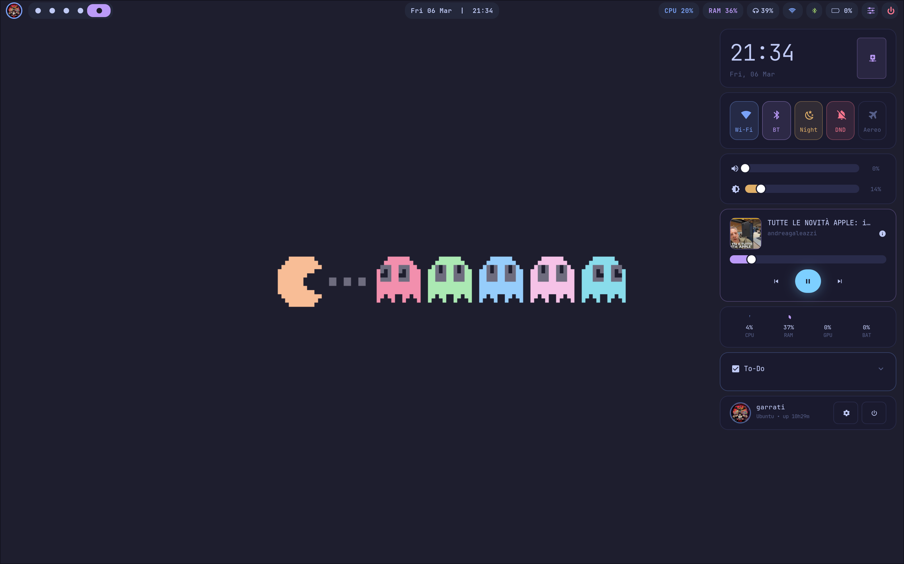

**Versione 2 (Android Style):**
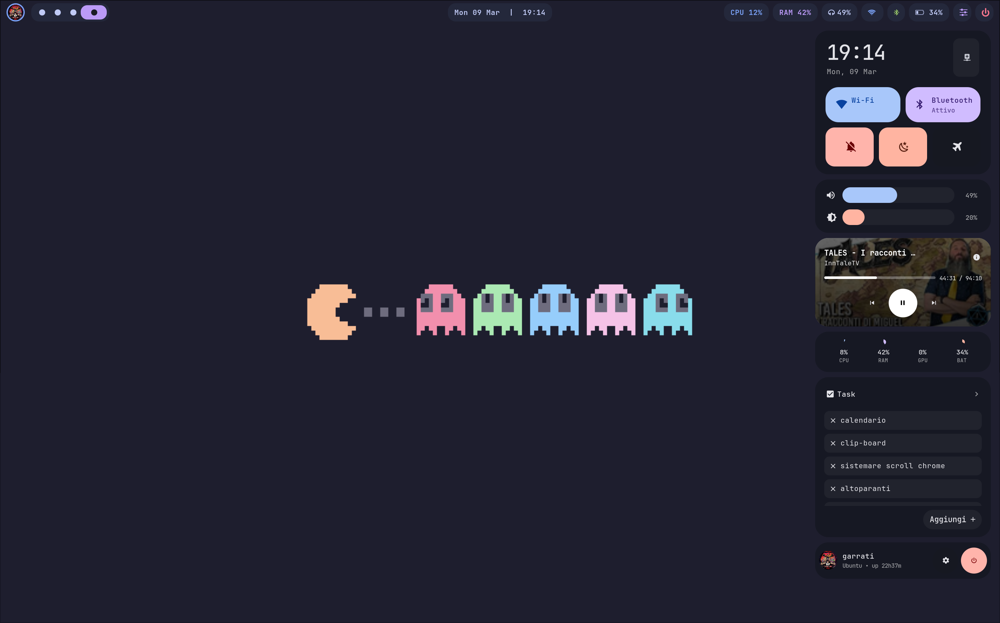

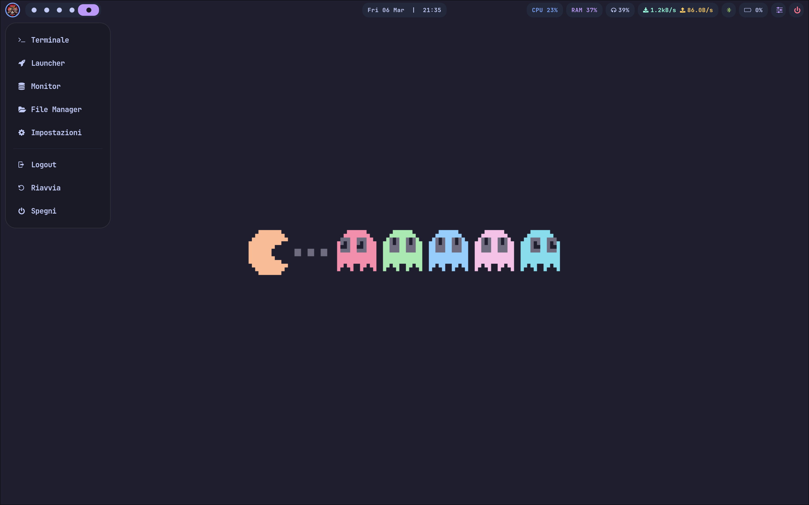

#### Gestione Rete, Bluetooth e Audio
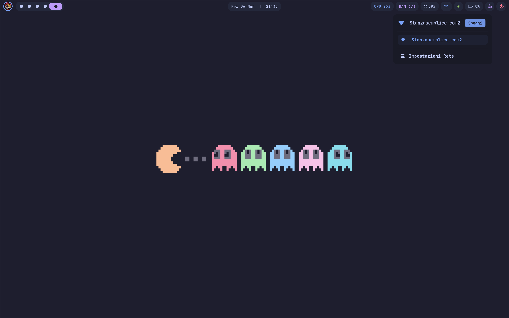

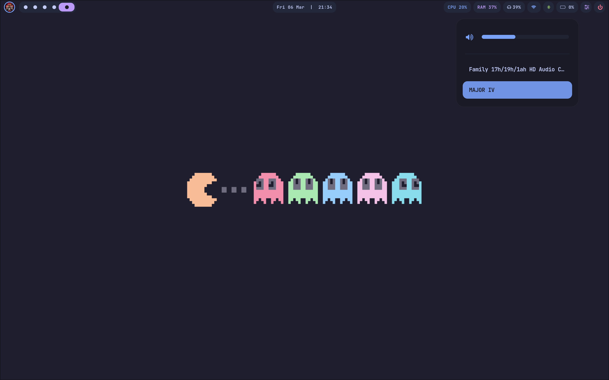

#### App Impostazioni Custom (Python)
Un'interfaccia grafica creata da me da zero per gestire le impostazioni principali.
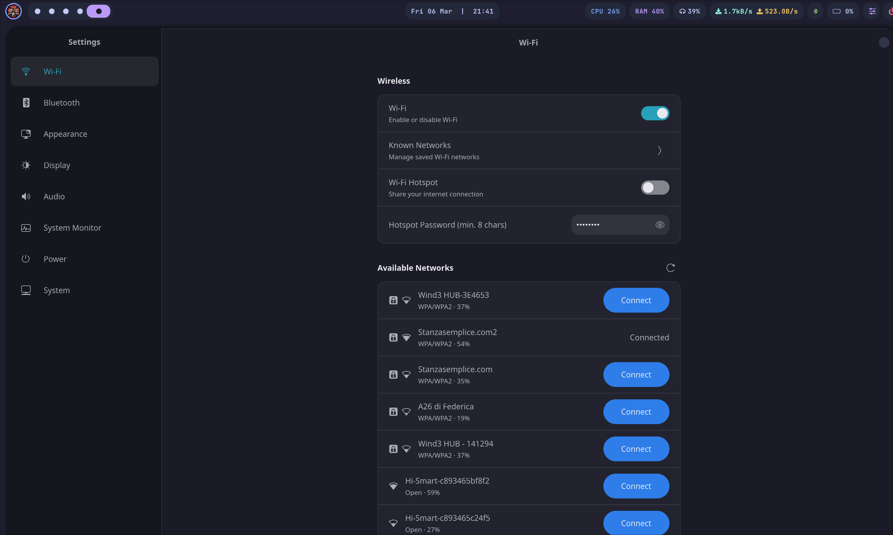
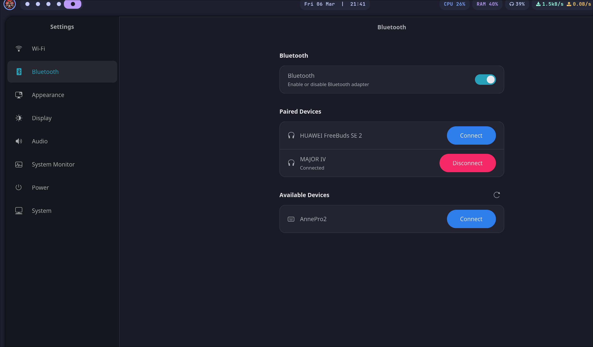
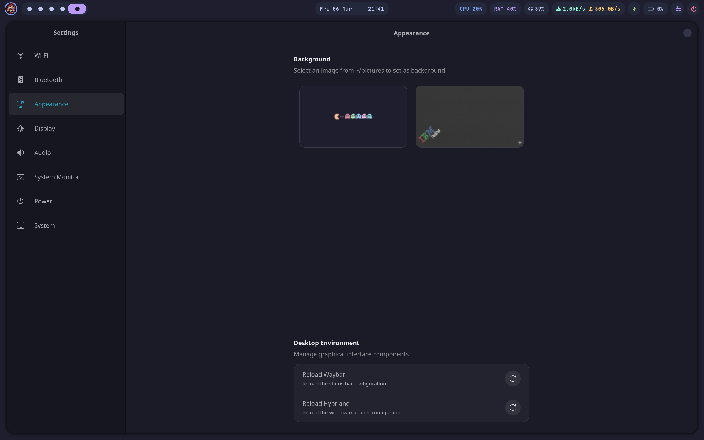

#### Power Menu
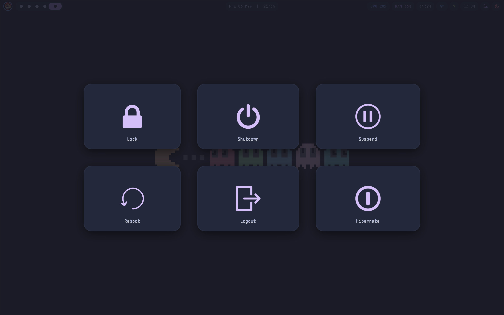

---

## 🛠️ Tecnologie e Strumenti Utilizzati

* **Window Manager:** [Hyprland](https://hyprland.org/)
* **Terminale:** Kitty
* **Barra di stato:** Waybar
* **Application Launcher:** Rofi
* **Sistema di Widget:** Eww (Elkowars Wacky Widgets)

---

## ✨ Funzionalità Principali

### 🎨 Widget Custom con Eww
Ho usato Eww per creare un ecosistema di widget fluttuanti completamente integrati con lo stile del sistema:
* **Control Center:** Un pannello unificato che include toggle rapidi (Wi-Fi, Bluetooth, Modalità Notte, ecc.), un media player, una to-do list e un mini monitor di sistema (CPU, RAM, ecc.).
* **Wi-Fi Manager:** Mostra le reti disponibili e conosciute, permettendo una connessione rapida con un clic.
* **Bluetooth Manager:** Visualizza, connette e disconnette i dispositivi associati (es. cuffie).
* **Controllo Volume:** Slider per il volume e selettore rapido per cambiare la periferica di uscita audio.
* **Menu Rapido (Dropdown):** Un menu a tendina per accedere rapidamente a Impostazioni, File Manager, Terminale, Launcher e opzioni di spegnimento.

### ⚙️ App di Impostazioni Personalizzata (Python)
Invece di affidarmi a tool di terze parti, sto sviluppando una mia applicazione scritta in **Python** per gestire il sistema. Attualmente permette di:
* Gestire connessioni Wi-Fi e Hotspot.
* Gestire i dispositivi Bluetooth.
* Cambiare lo sfondo.
* Gestire altre impostazioni di base.

> *Nota: Questo tool è ancora in fase di sviluppo e ho intenzione di ampliarlo notevolmente in futuro!*

---

## 📦 Installazione

Questa non è una guida passo-passo su come installare un sistema operativo da zero, ma una rapida panoramica delle dipendenze necessarie per far funzionare correttamente questi dotfiles (in particolare i widget Eww e l'app Python).

### 1. Dipendenze Essenziali
Assicurati di avere i seguenti pacchetti installati tramite il gestore di pacchetti della tua distribuzione (es. `pacman`, `yay`, `apt`, ecc.):

* **Core & UI:** `hyprland`, `kitty`, `waybar`, `rofi-wayland`, `eww` (assicurati che sia la build per Wayland)
* **Gestione Rete & Bluetooth:** `networkmanager` (utilizzato dai widget Wi-Fi), `bluez`, `bluez-utils` (per il controllo del Bluetooth tramite i pannelli)
* **Audio:** `pipewire`, `wireplumber` e strumenti CLI come `pamixer` o `wpctl` (fondamentali per collegare gli slider di Eww con l'audio di sistema)
* **App Impostazioni Custom:** `python3` e i moduli necessari per avviare la GUI (es. librerie GTK o PyQt, a seconda di come hai compilato l'app).
* **Font:** Per far sì che le icone vengano visualizzate correttamente nei pannelli e in Waybar, devi installare un [Nerd Font](https://www.nerdfonts.com/) (es. *JetBrainsMono Nerd Font*).

### 2. Applicazione dei Dotfiles

**⚠️ Attenzione:** Prima di procedere, ti consiglio caldamente di fare un backup delle tue attuali cartelle di configurazione!

Apri il terminale ed esegui:

```bash
# 1. Clona questo repository
git clone https://github.com/garrati-0/dotfilEs.git

# 2. Entra nella cartella clonata
cd dotfilEs

# 3. Esegui il backup delle tue configurazioni attuali (opzionale ma consigliato)
mv ~/.config/hypr ~/.config/hypr.backup
mv ~/.config/eww ~/.config/eww.backup
# (ripeti per rofi, waybar, kitty, ecc.)

# 4. Copia le nuove configurazioni nella tua home
cp -r .config/* ~/.config/
```

### 3. Controllo Percorsi e Tocchi Finali (CRITICO)
Dopo aver copiati i file, devi controllare e aggiornare i percorsi codificati (hardcoded).

**Immagini e Sfondi:** Controlla `hyprland.conf`, i tuoi file `.yuck` di Eww e il CSS di Waybar per assicurarti che i percorsi che puntano a immagini del profilo, asset o sfondi corrispondano al tuo nome utente (es. cambia `/home/garrati-0/...` in `/home/TUO_UTENTE/...`).

**Script:** Assicurati che i tuoi script e l'app Python abbiano i corretti permessi di esecuzione:

```bash
chmod +x ~/.config/percorso/del/tuo/script.py
```
Infine, riavvia Hyprland (disconnettiti e riconnettiti) per applicare tutte le modifiche.

---

## 🚀 Prossimi Sviluppi (To-Do)
Il ricing non finisce mai! Ecco cosa ho in programma di implementare prossimamente:

* [ ] **Dock per le applicazioni:** Creare o integrare una dock per l'accesso rapido alle applicazioni preferite.
* [ ] **Multitasking stile GNOME:** Implementare una visualizzazione dinamica degli spazi di lavoro simile alla panoramica delle attività di GNOME.
* [ ] **Integrazione Calendario:** Aggiungere un calendario collegato a Google Calendar all'interno dei widget.
* [ ] **Clipboard History:** Creare un widget o un menu Rofi per gestire la cronologia degli appunti.
* [ ] **Espansione dell'App Python:** Aggiungere nuove schede e funzionalità alla mia app di impostazioni (es. gestione temi, gestione display, ecc.).
